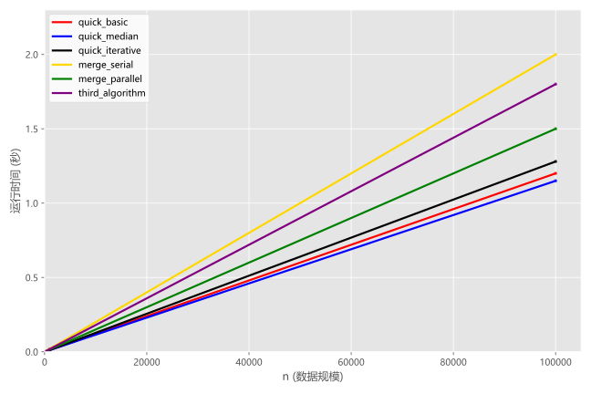
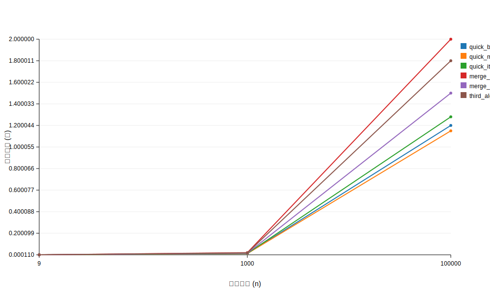

## C语言实验报告
### 1.安装Ubuntu 22.04
    根据ai指引，下载VMware虚拟机，并且到阿里云下载Ubuntu 22.04镜像文件，根据ai指引安装Ubuntu 22.04在虚拟机上，并且直接链接网络
    ps.本人因为看视频以为学会了，结果跟着下载了Ubuntu 22.04服务器版本，最后发现安装错误，于是还是跟者ai安装了正确版本
### 2.配置网络和安装gcc
    不知道为什么，我的虚拟机可以直接联网，所以直接下一步
    根据ai指引，输入 sudo apt install gcc-12 ，安装完毕

    安装vm-tools--sudo apt install open-vm-tools，设置共享文件夹

### 3.算法的实现
> 快速排序算法
    本质：找到pivot正确排序后应该在的位置，并且把一个数列分为两组，pivot左边是小于pivot的数，右边是大于pivot的数。

    找到pivot方法：随机和三数取中

>递归版本：

    1.插空法，想想定义一个temp把pivot取出来，然后用left和right指针遍历查询，比pivot小的放左边，比pivot大的放右边，最后，left和right相遇的时候就是pivot的位置。

    2.交换法，和第一个方法类似，不过就是利用了swap函数，不断交换pivot的位置，直到pivot的左边都是比它小的，右边都是比它大的（调用函数会压入栈帧，速度会更慢）

    3.索引定位法，声明一个索引i，表示pivot前一个的位置，每当出现有数比pivot小就进行一次交换，往前一个。到最后就是pivot应该在的位置

>迭代版本：

    利用栈压入low和high区间进行分段处理，先pop最顶上的区间，在把这个区间分为两部分，最后直到这个区间只有两个数时排序完成

> 归并排序算法

    利用从n-1到n的递归思想，假设处理两个已经排序好的区间，处理完成后同理得n-2到n-1......

    利用omp，#program omp parllel sections 创造两个并行区域，但是这个是固定的，会因为fork-join的不断出现而使速度变慢,并且merge函数中利用一个临时数组需要for传递数据，所以利用#program omp parllel for

    更快的做法是用任务任务族，#program omp task 这样速度会更快一点，task会尽可能的压榨cup性能，但是在归并排序中速度不及section，猜想是for的问题

### 3.1 代码编写

查询github

### 4。数据展示
    1.生成数据，一开始利用C语言自带的random生成数据，结果后面发现要实现 csv的文件，读取，所以学习了python的panda和numpy库，生成了浮点数和整形的随机数据。
    2.编写自动运行脚本，这一部分看不懂，感谢ai给我写好了（一开始其实打算在主机上完成混过去的，结果发现自动运行脚本必须在linux上运行）
### 5.矢量图
    运行代码并绘制矢量图，依旧感谢ai把矢量图给我画好了

>失败的ai图像

### 实验感想

    感谢超算让我体验到优化的乐趣，计算机的实践成本真的很低，每一次成功运行，速度上升，都让我感到由内到外的愉悦。

    在这次实验中我学到了很多，如C语言如何实现泛型，C语言的文件读写（虽然代码中没有体现），OMP的并行使用，python的基本语法和numpy和panda库（剩下的东西我会慢慢补全的比如画图和如何自动化运行脚本）

    让我真正的体会到了计算机的乐趣，各种并行区域，可以随意的实验，达到满意的实验结构在进行思考为什么会变快，真的十分有乐趣，及时反馈真的很爽(就是一开始搞错了，以为是用gcc -O0 test.c -o test指令统计数据画图,结果最后发现要搞python，绝望了属于是)

特别鸣谢：deepseek kimi Copilot

